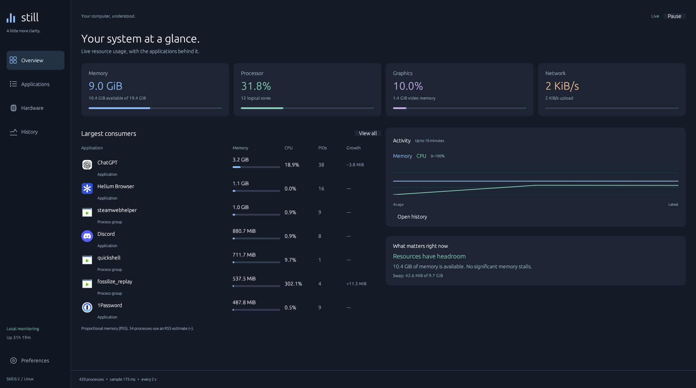

<div align="center">


# Still

**Your computer, understood.**

A native Linux system monitor for seeing what uses your resources — and when.

[](https://github.com/eapzzz/still/actions/workflows/ci.yml)
[](LICENSE)

</div>



Still brings memory, CPU, graphics, storage and networking into one calm desktop app. Written in Rust with egui. No Electron, local web server, account or background daemon.

## A clearer picture

- **Overview:** resource totals, recent activity, largest consumers and observations grounded in Linux pressure counters.
- **Applications:** search by name, executable or PID; sort by memory, CPU, process count, name or session growth. Installed desktop metadata supplies names and icons. Helpers within a known installation directory are included with their application; other processes are grouped by executable.
- **Process details:** proportional, resident and private memory, swap, CPU, threads, parent PID and command line. Send `SIGTERM` to one process after confirmation. A stable pidfd and start-time check protect against PID reuse.
- **Hardware:** per-core CPU, load averages, GPU/VRAM, local filesystem space, physical disk throughput, network interfaces, temperatures, fans, power and battery readings where exposed by the system.
- **History:** up to ten minutes of session data, timestamp-scaled charts, visible sampling gaps and CSV export. Missing GPU readings remain empty in the export.
- **Preferences:** 1/2/5/10-second sampling and interface scaling, saved locally. Pause collection when you need to inspect a snapshot.

## Install

Linux with a current stable Rust toolchain, an OpenGL-capable driver, and either Wayland or X11.

On Arch:

```sh
sudo pacman -S --needed rust base-devel libxkbcommon wayland libglvnd

git clone https://github.com/eapzzz/still.git
cd still
./install.sh
```

Press **Super**, type **Still**, and launch it. The installer places the binary in `~/.local/bin`, and the desktop entry and icon in your XDG data directory. Its desktop entry uses an absolute executable path, so launcher PATH differences do not matter. Python 3 is needed only by the local install/uninstall scripts.

```sh
./run.sh                 # Run from the checkout; builds if needed
still --summary          # Terminal resource summary
still --json             # Machine-readable snapshot
still --help
./uninstall.sh           # Keeps preferences and exported history
```

You can override the binary prefix with `PREFIX`. `XDG_DATA_HOME` controls desktop integration. An experimental Arch VCS recipe is in [`packaging/PKGBUILD`](packaging/PKGBUILD); **Still is not published on AUR yet**. Review and test it in a clean chroot before an AUR submission. Only x86_64 has been runtime-tested here; aarch64 is a packaging target, not a verified build.

## Reading the numbers

| Measurement | Meaning |
| --- | --- |
| System memory | `MemTotal − MemAvailable`; includes more than applications |
| Application memory | PSS: shared pages apportioned among processes, with `~` for RSS fallbacks when access is denied |
| Private memory | USS from private clean + dirty pages; unavailable when only RSS can be read |
| Process CPU | 100% equals one logical core, so a multi-core app can exceed 100% |
| System CPU | Busy time across all logical cores, from counter differences |
| Pressure | Time tasks waited for a resource, averaged over the last ten seconds |
| Growth | Change since a currently running application was first observed in this session; not a leak diagnosis |

PSS is **not** a promise of how much RAM closing an app will reclaim. The process list is sampled over time, not atomically. Application estimates need not add up to system memory. Buffers/cache and available memory overlap. CPU and throughput need two samples to become meaningful.

See the Linux kernel documentation for [procfs memory accounting](https://docs.kernel.org/filesystems/proc.html) and [pressure stall information](https://docs.kernel.org/accounting/psi.html).

## Hardware support and limits

- CPU, memory, processes, networking and disk counters come from procfs; sensors come from hwmon and power_supply.
- GPU discovery uses DRM. Utilization and VRAM currently use the sysfs counters exposed by **amdgpu**. Other DRM GPUs are listed but may show unavailable metrics. There is no NVIDIA NVML backend yet.
- GPU names use the optional local `pci.ids` database (`hwdata` on Arch), with PCI identifiers as fallback.
- Filesystem space covers local ext3/ext4, Btrfs, XFS, FAT, F2FS, NTFS3 and exFAT mounts, once per device. Remote filesystems are skipped to avoid blocking on a disconnected server. Space refreshes every fifteen samples.
- Virtual network interfaces can count the same traffic twice; the Hardware page shows each interface separately.
- Desktop metadata is indexed at startup. Restart Still after installing applications or changing icon themes. Unknown programs receive a distinct monogram.
- History is in-memory and ends when the app exits. There is no per-process network accounting, SMART drive health, historical database or notification daemon.

## Performance and privacy

Sampling runs on one background thread. The UI repaints on input or a new sample, and only the newest snapshot is retained. History is capped at 601 samples. Exact PSS scans have a real kernel cost: use a 5- or 10-second interval on busy systems. Still is designed to stay small, not to claim zero overhead.

No usage data leaves your machine. Settings live at `$XDG_CONFIG_HOME/still/settings.json` (normally `~/.config/still`). CSV files go to `$XDG_DATA_HOME/still/exports` (normally `~/.local/share/still/exports`) and contain system metrics, not process command lines. The JSON CLI includes executable paths; review it before sharing.

## Development

```sh
cargo fmt --check
cargo clippy --locked --all-targets -- -D warnings
cargo test --locked
cargo build --release --locked
desktop-file-validate still.desktop
```

Collectors, desktop metadata, process accounting and the UI are separate modules. See [CONTRIBUTING.md](CONTRIBUTING.md) and [validation notes](docs/VALIDATION.md).

Still replaces the earlier RamRadar project. The previous source remains in Git history. MIT licensed; see [LICENSE](LICENSE).
